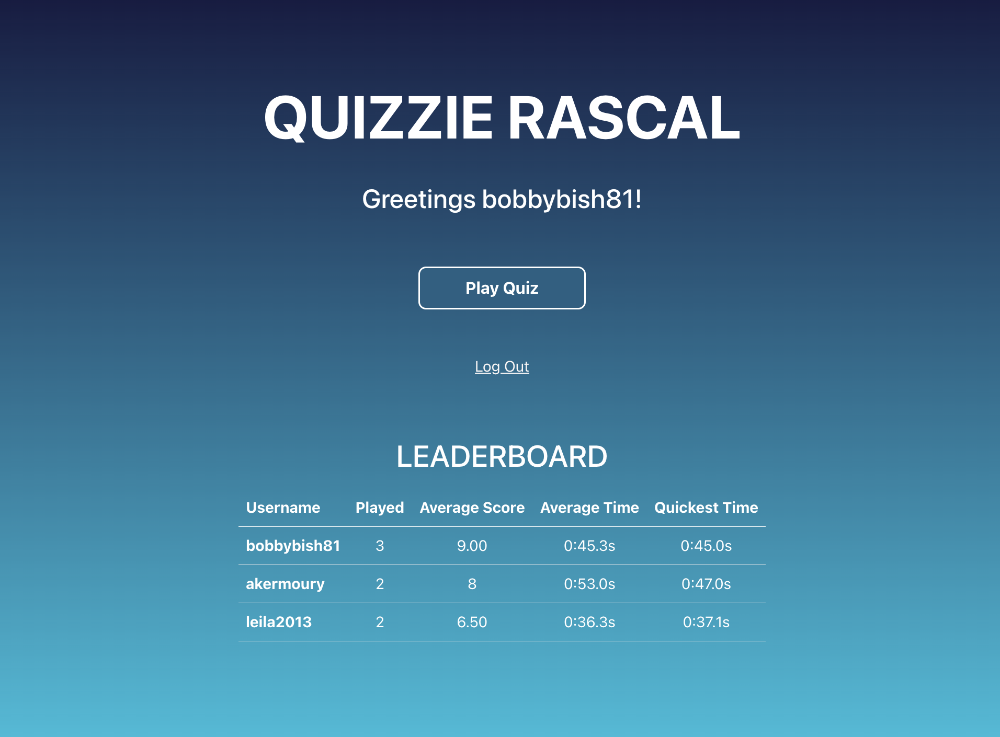

# Quizzie Rascal

# Deployed link: https://quizzierascal.netlify.app

## Introduction
Quizzie Rascal is a quiz game that presents the user with 10 random questions with 4 possible answers thast are to be answered as quickly as possible. To play the game the user must first register (if not already registered) or login with an email and password. The user results (i.e. score/timetaken) are recorded and displayed on the homepage in the form of a leaderboard.
The login details are verified by an express server in Node.js with resources provided from a mongoDB database.

The questions are fetched with every play from the following api: https://the-trivia-api.com/api/questions

# Technologies
React JS • 
Typescript • 
Bootstrap • 
Mui/Material • 
Formik • 
Axios • 
Node JS

# Getting Started
Clone this repository then run the following commands: 
  - npm install
  - npm start

# Author
<h3>Robert Bish</h3>

